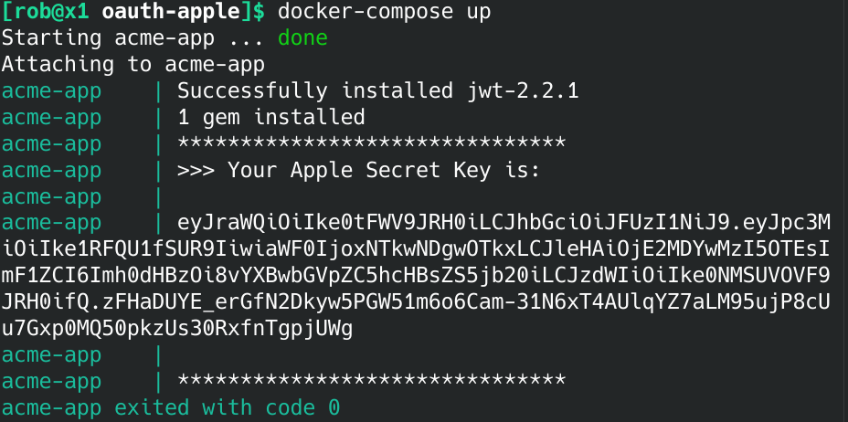

A handy docker container to help generate the Apple OAuth Secrets

# Generate Apple OAuth Secret Key

1. Add your secrect key to `./data/key.txt`.

2. Edit The following variables in your `./data/client_secret.rb`.

```
TEAM_ID: 'XXXXXXXXX'
CLIENT_ID: 'au.com.domain.service-id'
KEY_ID: 'XXXXXXXXX'
```

3. Generate the secret key by running:
`docker-compose up`

Your output will look like the following:




Generate a new key with:

`openssl ecparam -genkey -name prime256v1 -noout -out ./data/key.txt`